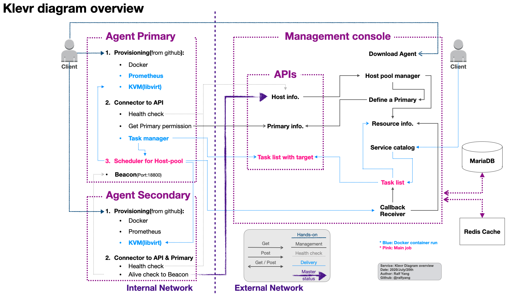

# Klevr: Kloud-native everywhere
## Interconnector for the Platform based SaaS delivery
 * Asynchronous distributed infrastructure management console and agent for separated networks.
 * Supports for:
   * Baremetal server in the On-premise datacenter
   * PC/Workstation in the Office/intranet
   * Laptop at everywhere
   * Public-cloud

## Kickstart for webconsole & KVstore
* docker-compose command
```
git clone https://github.com/ralfyang/klevr.git
docker-compose up -d
```

## Diagram Overview
 * Image click to Youtube:
 * [](https://youtu.be/xLkqm1vEmd0)

## Features
 * **[Agent](./agent/)**
   * Provisioning: Docker, Kubernetes, Micro K8s(on Linux laptop) with Vagrant & VirtualBox, Prometheus 
   * Get & Run: Hypervisor(via libvirt container or Multipass), Terraform, Prometheus, Beacon, Helm chart
   * Metric data aggregate & delivery
  * **[Web console](./webconsole/)**
   * Host pool management
   * Resource management
   * Primary host management 
   * Task management(To be)
   * Service catalog management(To be)
   * Service delivery to Dev./Stg./Prod.(To be)
 * **Docker images**
   * [Webconsole](./Dockerfile/klevr_websonsole)(Webserver): [klevry:webconsole:latest](https://hub.docker.com/repository/docker/klevry/webconsole)
   * ~~[Beacon](./Dockerfile/beacon)(Primary agent health checker): [klevry/beacon:latest](https://hub.docker.com/repository/docker/klevry/beacon)~~
   * [Libvirt](./Dockerfile/libvirt)(Hypervisor): [klevry/libvirt:latest](https://hub.docker.com/repository/docker/klevry/libvirt)
   * ~~Prometheus operator(Service discovery)~~
   * [ProvBee](https://github.com/NexClipper/provbee)(nexclipper/provbee)  
   * ~~Metric crawler~~
   * Task manager
 * **KV store([Consul](https://github.com/hashicorp/consul))**
   
## Simple logic of asynchronous task management - (Click to Youtube for details)
 * [](https://www.youtube.com/watch?v=hyMaVsCcgbA&t=2s)

## Requirement for use
 * [x] Docker/Docker-compose/Docker-registry
   * [x] ~~Beacon~~
   * [x] Libvirt
   * [x] Task manage to [ProvBee](https://github.com/NexClipper/provbee)
 * [x] Terraform of container by [ProvBee](https://github.com/NexClipper/provbee)
 * [x] KVM(libvirt) by [ProvBee](https://github.com/NexClipper/provbee)
 * [x] Multipass for Hosted Virtual-machine
 * [x] ~~Micro K8s~~ K3s
 * [x] Prometheus by [ProvBee](https://github.com/NexClipper/provbee)
 * [x] Grafana by [ProvBee](https://github.com/NexClipper/provbee)
 * [x] Helm by [ProvBee](https://github.com/NexClipper/provbee)
 * [ ] ~~Vault(maybe)~~
 * [ ] ~~Packer(maybe)~~
 * [x] ~~Vagrant~~
 * [x] ~~Consul~~ 

## Description for Directories and files
```
.
├── README.md                   // This Screen as you see. :)
├── docker-compose.yml          // Kickstarter: Bootstraping by docker-compose
├── Dockerfile                  // Directory for docker image build
│   ├── libvirt
│   └── manager                 // Actual binary file of manager will be move to this link directory for the docker build
├── assets
│   └── [Images & Contents]
├── cmd                         // Actual artifacts fpr Klevr agent & manager(webserver) 
│   ├── klevr-agent
│   │   ├── Makefile
│   │   ├── agent_installer.sh  // Remote installer via curl command as a generated script by Manager
│   │   ├── klevr               // Actual `Klevr` agent binary
│   │   └── main.go             // main source code of the Agent
│   └── klevr-manager
│       ├── Docker -> ../../Dockerfile/manager  // Binary artifact send to this directory for Docker build  
│       ├── Makefile
│       └── main.go             // main source code of the Manager
├── conf
│   ├── Dump20200720.sql        // Database for Manager initializing & running
│   └── klevr-manager-local.yml // Config file for Manager running
├── pkg
│   ├── common                  // 'common' package directory
│   │   ├── config.go
│   │   ├── error.go
│   │   ├── http.go
│   │   ├── log.go
│   │   └── orm.go
│   ├── communicator            // 'communicator' package directory
│   │   ├── README.md
│   │   └── communicator.go
│   └── manager                 // 'manager' package directory
│       ├── api.go
│       ├── api_agent.go
│       ├── api_install.go
│       ├── api_legacy.go
│       ├── api_model.go
│       ├── handler.go
│       ├── persist_model.go
│       ├── repository.go
│       └── server.go
├── go.mod
├── go.sum
└── scripts                    // Operation script for Provisioning
    └── [Provisioning scripts]

```
